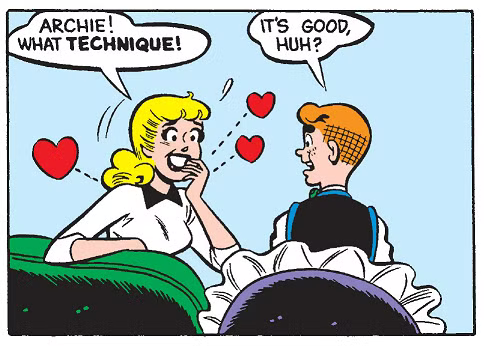

# Bevy Archie - Rust / Bevy Controller Support Module

[](https://opensource.org/licenses/MIT)
[](https://opensource.org/licenses/Apache-2.0)
[](https://www.rust-lang.org)
[](https://bevyengine.org)
[](target/coverage/tarpaulin-report.html)



A comprehensive game controller support module for the Bevy engine, inspired by the RenPy Controller GUI project.

## Controller Support Matrix

| Controller           | Gyroscope | Touchpad | Adaptive Triggers | Rumble | Layout      |
|----------------------|:---------:|:--------:|:-----------------:|:------:|-------------|
| Xbox 360             | 🔴        | 🔴       | 🔴                | ✅     | Xbox        |
| Xbox One             | 🔴        | 🔴       | 🔴                | ✅     | Xbox        |
| Xbox Series X\|S     | 🔴        | 🔴       | 🔴                | ✅     | Xbox        |
| PlayStation 4        | ✅        | ✅       | 🔴                | ✅     | PlayStation |
| PlayStation 5        | ✅        | ✅       | ✅                | ✅     | PlayStation |
| Switch Pro           | ✅        | 🔴       | 🔴                | ✅     | Nintendo    |
| Switch Joy-Con       | ✅        | 🔴       | 🔴                | ✅     | Nintendo    |
| Steam Controller     | ✅        | ✅       | 🔴                | ✅     | Xbox        |
| Stadia               | ✅        | 🔴       | 🔴                | ✅     | Xbox        |
| Generic              | 🔶        | 🔶       | 🔴                | ✅     | Xbox        |

> **Legend**: ✅ Supported | 🔴 Hardware limitation | 🔶 Unknown (varies by device)
>
> **Note**: Gyroscope, touchpad, and adaptive triggers require platform-specific implementations. See [Advanced Features](#advanced-features) for details.

## Features

### Core Input System

- **Input Device Detection**: Automatically detect and switch between mouse, keyboard, and gamepad input
- **Input Action Mapping**: Abstract input actions with customizable bindings for gamepad, keyboard, and mouse
- **Action State Tracking**: Query pressed, just_pressed, just_released states and analog values for any action
- **Per-Stick Settings**: Independent sensitivity and inversion for left/right analog sticks
- **Deadzone Configuration**: Configurable stick deadzones with per-stick customization

### Controller Support

- **Controller Icon System**: Asset-agnostic icon mapping system that adapts to controller type (Xbox, PlayStation, Nintendo, Steam, Stadia, Generic). Bring your own icon assets or use any compatible pack.
- **Controller Profiles**: Automatic detection and profile loading based on vendor/product IDs
- **Multi-controller Support**: Handle multiple connected controllers with player assignment
- **Controller Layout Detection**: Auto-detect and adapt UI to controller type

### Advanced Input Features

- **Haptic Feedback**: Rumble and vibration patterns (Constant, Pulse, Explosion, DamageTap, HeavyImpact, Engine, Heartbeat) - fully implemented
- **Input Buffering**: Record and analyze input sequences for fighting game-style combo detection
- **Action Modifiers**: Detect Tap, Hold, DoubleTap, LongPress, and Released events on actions
- **Gyroscope Support**: Motion controls for PS4/PS5/Switch/Stadia/Steam controllers - complete gesture detection and data structures, needs hardware driver integration (HID/SDL2). See [ps5_dualsense_motion.rs](examples/ps5_dualsense_motion.rs) and [switch_pro_gyro.rs](examples/switch_pro_gyro.rs)
- **Touchpad Support**: PS4/PS5/Steam touchpad input with multi-touch and gesture detection (swipe, pinch, tap) - complete gesture detection and data structures, needs hardware driver integration (HID/SDL2). See [ps5_dualsense_motion.rs](examples/ps5_dualsense_motion.rs) and [steam_touchpad.rs](examples/steam_touchpad.rs)

### Multiplayer

- **Player Assignment**: Automatic or manual controller-to-player assignment (up to 4 players)
- **Controller Ownership**: Track which player owns which controller
- **Hot-swapping**: Handle controller disconnection and reassignment

### UI & Configuration

- **Controller Remapping**: Allow players to remap controller buttons at runtime
- **Virtual Keyboard**: On-screen keyboard for controller-friendly text input
- **Virtual Cursor**: Gamepad-controlled cursor for mouse-based UI navigation
- **Configuration Persistence**: Save and load controller settings to/from JSON files

### Developer Tools

- **Input Debugging**: Visualize input states, history, and analog values
- **Input Recording**: Record input sequences for testing and replay
- **Input Playback**: Play back recorded inputs for automated testing

## Supported Controllers

- **Xbox** - Xbox 360, Xbox One, Xbox Series X|S controllers
- **PlayStation** - PS3, PS4, PS5 (DualShock and DualSense)
- **Nintendo** - Switch Pro Controller, Joy-Cons
- **Steam** - Steam Controller, Steam Deck
- **Stadia** - Google Stadia Controller (Bluetooth mode)
- **Generic** - Any other standard gamepad

**Note**: Stadia controllers must be switched to Bluetooth mode (a permanent one-time operation that was available until Dec 31, 2025). In Bluetooth mode, they function as standard Xbox-style gamepads.

## Installation

Add to your `Cargo.toml`:

```toml
[dependencies]
bevy_archie = { path = "path/to/bevy-archie" }
# Or with specific features:
bevy_archie = { path = "path/to/bevy-archie", features = ["full"] }
```

## Quick Start

```rust
use bevy::prelude::*;
use bevy_archie::prelude::*;

fn main() {
    App::new()
        .add_plugins(DefaultPlugins)
        .add_plugins(ControllerPlugin::default())
        .add_systems(Startup, setup)
        .add_systems(Update, handle_input)
        .run();
}

fn setup(mut commands: Commands) {
    commands.spawn(Camera2d);
}

fn handle_input(
    input_state: Res<InputDeviceState>,
    actions: Res<ActionState>,
) {
    // Check which input device is active
    match input_state.active_device {
        InputDevice::Mouse => { /* Mouse logic */ }
        InputDevice::Keyboard => { /* Keyboard logic */ }
        InputDevice::Gamepad(_) => { /* Controller logic */ }
    }

    // Check action states
    if actions.just_pressed(GameAction::Confirm) {
        println!("Confirm pressed!");
    }
}
```

## Action System

Define your game actions and bind them to controller buttons:

```rust
use bevy_archie::prelude::*;

// Actions are predefined, but you can extend with custom actions
fn setup_actions(mut action_map: ResMut<ActionMap>) {
    // Rebind an action
    action_map.bind(GameAction::Confirm, GamepadButtonType::South);
    action_map.bind(GameAction::Cancel, GamepadButtonType::East);
    
    // Add keyboard bindings
    action_map.bind_key(GameAction::Confirm, KeyCode::Enter);
    action_map.bind_key(GameAction::Cancel, KeyCode::Escape);
}
```

## Controller Icons

**Note**: bevy-archie is asset-agnostic. You must provide your own icon assets or use a compatible icon pack like:

- [Mr. Breakfast's Free Prompts](https://mrbreakfastsdelight.itch.io/mr-breakfasts-free-prompts) (400+ icons, Xbox/PS/Switch/Steam Deck)
- [Kenney Input Prompts](https://kenney.nl/assets/input-prompts)
- Custom artwork

The icon system provides platform-aware filename generation and asset loading infrastructure. Point it to your icon directory:

```rust
fn setup_icons(mut commands: Commands) {
    commands.insert_resource(
        ControllerIconAssets::new("assets/icons")  // Your icon directory
    );
}
```

Display controller-appropriate button icons in your UI:

```rust
fn spawn_button_prompt(
    mut commands: Commands,
    icon_assets: Res<ControllerIconAssets>,
    input_state: Res<InputDeviceState>,
) {
    let icon = icon_assets.get_icon(
        GamepadButtonType::South,
        input_state.controller_layout,
    );
    
    commands.spawn(ImageNode {
        image: icon,
        ..default()
    });
}
```

### Icon Naming Conventions

The system expects icons named according to platform conventions:

- **Xbox**: `xbox_a.png`, `xbox_b.png`, `xbox_lb.png`, `xbox_lt.png`
- **PlayStation**: `ps_cross.png`, `ps_circle.png`, `ps_l1.png`, `ps_l2.png`
- **Nintendo**: `switch_b.png`, `switch_a.png`, `switch_l.png`, `switch_zl.png`
- **Generic**: `left_stick.png`, `right_stick.png`, `dpad.png`

Icon sizes are supported via suffixes: `xbox_a_small.png` (32x32), `xbox_a.png` (48x48), `xbox_a_large.png` (64x64).

If your icon pack uses different naming, create a thin wrapper or use symbolic links to match the expected names.

## Remapping

Enable controller remapping in your settings menu:

```rust
fn spawn_remap_ui(mut commands: Commands) {
    commands.spawn((
        RemapButton {
            action: GameAction::Confirm,
        },
        // ... UI components
    ));
}
```

## Configuration

```rust
use bevy_archie::prelude::*;

fn configure_controller(mut config: ResMut<ControllerConfig>) {
    // Stick deadzone (0.0 - 1.0)
    config.deadzone = 0.15;
    
    // Per-stick sensitivity multipliers
    config.left_stick_sensitivity = 1.0;
    config.right_stick_sensitivity = 1.5; // Faster cursor movement
    
    // Per-stick X-axis inversion
    config.invert_left_x = false;
    config.invert_right_x = true; // Inverted camera controls
    
    // Auto-detect controller layout
    config.auto_detect_layout = true;
    
    // Force a specific layout
    config.force_layout = Some(ControllerLayout::PlayStation);
}
```

## Virtual Cursor

Enable gamepad-controlled cursor for mouse-based UI:

```rust
use bevy::prelude::*;
use bevy_archie::prelude::*;

fn setup(mut commands: Commands, asset_server: Res<AssetServer>) {
    // Spawn virtual cursor (automatically shown when gamepad active)
    bevy_archie::virtual_cursor::spawn_virtual_cursor(
        &mut commands,
        &asset_server,
        None, // Uses default cursor.png
    );
}

fn handle_clicks(mut click_events: EventReader<VirtualCursorClick>) {
    for event in click_events.read() {
        println!("Cursor clicked at: {:?}", event.position);
    }
}
```

## Configuration Persistence

Save and load controller settings:

```rust
use bevy_archie::prelude::*;

// Load config on startup
fn load_config(mut config: ResMut<ControllerConfig>) {
    *config = ControllerConfig::load_or_default().unwrap();
}

// Save config
fn save_config(config: Res<ControllerConfig>) {
    config.save_default().unwrap();
}

// Custom path
fn save_to_custom_path(config: Res<ControllerConfig>) {
    config.save_to_file("my_config.json").unwrap();
}
```

Config files are saved to platform-specific directories:

- **Linux**: `~/.config/bevy_archie/controller.json`
- **macOS**: `~/Library/Application Support/bevy_archie/controller.json`
- **Windows**: `%APPDATA%\bevy_archie\controller.json`

## Examples

Bevy-archie includes several examples to help you get started:

### Basic Examples

- **[basic_input.rs](examples/basic_input.rs)**: Simple input handling
- **[controller_icons.rs](examples/controller_icons.rs)**: Display controller-specific icons
- **[remapping.rs](examples/remapping.rs)**: Runtime button remapping
- **[virtual_cursor.rs](examples/virtual_cursor.rs)**: Gamepad-controlled cursor
- **[config_persistence.rs](examples/config_persistence.rs)**: Save/load settings

### Advanced Hardware Integration

These examples show how to integrate real hardware for gyro and touchpad:

- **[ps5_dualsense_motion.rs](examples/ps5_dualsense_motion.rs)**: DualSense gyro + touchpad via hidapi
  - Complete HID report parsing reference
  - Both USB and Bluetooth modes
  - Calibration and data injection patterns
  
- **[switch_pro_gyro.rs](examples/switch_pro_gyro.rs)**: Switch Pro Controller gyro via SDL2
  - Cross-platform gyro support
  - Alternative: Direct HID approach
  
- **[steam_touchpad.rs](examples/steam_touchpad.rs)**: Steam Deck/Steam Controller touchpad
  - Steam Input API integration (recommended)
  - Alternative: Direct HID for advanced users

Run examples with:

```bash
cargo run --example basic_input
cargo run --example ps5_dualsense_motion --features motion-backends
```

## Supported Controller Layouts

- **Xbox**: Xbox 360, Xbox One, Xbox Series controllers
- **PlayStation**: DualShock 3/4, DualSense
- **Nintendo**: Joy-Con, Pro Controller, GameCube
- **Steam**: Steam Controller, Steam Deck
- **Stadia**: Google Stadia Controller (Bluetooth mode)
- **Generic**: Fallback for unrecognized controllers

## Advanced Features

### Haptic Feedback

Add rumble and vibration to your game:

```rust
use bevy_archie::prelude::*;

fn trigger_rumble(
    mut rumble_events: MessageWriter<RumbleRequest>,
    gamepads: Query<Entity, With<Gamepad>>,
) {
    for gamepad in gamepads.iter() {
        // Simple rumble
        rumble_events.write(RumbleRequest::new(
            gamepad,
            0.8,  // Intensity (0.0-1.0)
            Duration::from_millis(500),
        ));
        
        // Pattern-based rumble
        rumble_events.write(RumbleRequest::with_pattern(
            gamepad,
            RumblePattern::Explosion,  // Strong fade effect
            0.9,
            Duration::from_secs(1),
        ));
    }
}

// Available patterns:
// - Constant: Steady vibration
// - Pulse: Rhythmic pulsing
// - Explosion: Strong start with fade
// - DamageTap: Quick impact feel
// - HeavyImpact: Longer impact
// - Engine: Motor-like hum
// - Heartbeat: Pulse pattern
```

### Input Buffering & Combos

Detect input sequences for fighting game mechanics:

```rust
use bevy_archie::prelude::*;

fn setup_combos(mut registry: ResMut<ComboRegistry>) {
    // Define a combo sequence
    registry.register(
        Combo::new("hadouken", vec![
            GameAction::Down,
            GameAction::Right,
            GameAction::Primary,
        ])
        .with_window(Duration::from_millis(500))
    );
}

fn handle_combos(
    mut combo_events: MessageReader<ComboDetected>,
) {
    for event in combo_events.read() {
        println!("Combo detected: {}", event.combo);
        // Trigger special move
    }
}
```

### Multiplayer Controller Management

Assign controllers to players:

```rust
use bevy_archie::prelude::*;

fn setup_players(mut commands: Commands) {
    // Spawn player entities
    commands.spawn(Player::new(0)); // Player 1
    commands.spawn(Player::new(1)); // Player 2
}

fn manual_assignment(
    mut assign_events: MessageWriter<AssignControllerRequest>,
    gamepads: Query<Entity, With<Gamepad>>,
) {
    // Manually assign a controller to a player
    if let Some(gamepad) = gamepads.iter().next() {
        assign_events.write(AssignControllerRequest {
            gamepad,
            player: PlayerId::new(0),
        });
    }
}

fn check_ownership(
    ownership: Res<ControllerOwnership>,
    input: Res<ActionState>,
) {
    // Check which player owns a gamepad
    if let Some(player_id) = ownership.get_owner(gamepad_entity) {
        println!("Controller owned by player {}", player_id.id());
    }
    
    // Get gamepad for a specific player
    if let Some(gamepad) = ownership.get_gamepad(PlayerId::new(0)) {
        // Read input for player 1's controller
    }
}
```

### Action Modifiers

Detect advanced input patterns:

```rust
use bevy_archie::prelude::*;

fn handle_modifiers(
    mut modifier_events: MessageReader<ModifiedActionEvent>,
) {
    for event in modifier_events.read() {
        match event.modifier {
            ActionModifier::Tap => {
                println!("Quick tap on {:?}", event.action);
            }
            ActionModifier::Hold => {
                println!("Held for {} seconds", event.duration);
            }
            ActionModifier::DoubleTap => {
                println!("Double-tapped!");
            }
            ActionModifier::LongPress => {
                println!("Long press detected");
            }
            ActionModifier::Released => {
                println!("Button released");
            }
        }
    }
}

// Configure modifier timings
fn configure_modifiers(mut state: ResMut<ActionModifierState>) {
    state.config.hold_duration = 0.2;        // 200ms for hold
    state.config.long_press_duration = 0.8;  // 800ms for long press
    state.config.double_tap_window = 0.3;    // 300ms between taps
}
```

### PlayStation Touchpad

Handle touchpad input on DualShock 4 and DualSense:

```rust
use bevy_archie::prelude::*;

fn handle_touchpad(
    mut gesture_events: MessageReader<TouchpadGestureEvent>,
    touchpad_query: Query<&TouchpadData>,
) {
    // Handle gestures
    for event in gesture_events.read() {
        match event.gesture {
            TouchpadGesture::Tap => println!("Tapped at {:?}", event.position),
            TouchpadGesture::TwoFingerTap => println!("Two-finger tap"),
            TouchpadGesture::SwipeLeft => println!("Swiped left"),
            TouchpadGesture::SwipeRight => println!("Swiped right"),
            TouchpadGesture::SwipeUp => println!("Swiped up"),
            TouchpadGesture::SwipeDown => println!("Swiped down"),
            TouchpadGesture::PinchIn => println!("Pinch in (zoom out)"),
            TouchpadGesture::PinchOut => println!("Pinch out (zoom in)"),
        }
    }
    
    // Direct touchpad access
    for touchpad in touchpad_query.iter() {
        let finger1_pos = touchpad.finger1.position();
        let finger1_delta = touchpad.finger1_delta();
        
        if touchpad.button_pressed {
            println!("Touchpad button pressed");
        }
        
        println!("Active fingers: {}", touchpad.active_fingers());
    }
}
```

### Controller Profiles

Automatically detect controller models and load profiles:

```rust
use bevy_archie::prelude::*;

fn setup_profiles(mut registry: ResMut<ProfileRegistry>) {
    // Register a custom profile for PS5 controllers
    let ps5_profile = ControllerProfile::new("PS5 Default", ControllerModel::PS5)
        .with_action_map(my_custom_action_map())
        .with_layout(ControllerLayout::PlayStation);
    
    registry.register(ps5_profile);
    registry.auto_load = true;  // Auto-apply profiles when controllers connect
}

fn handle_detection(
    mut detected_events: MessageReader<ControllerDetected>,
    detected_query: Query<&DetectedController>,
) {
    for event in detected_events.read() {
        println!("Detected: {:?}", event.model);
        
        // Check controller capabilities
        if event.model.supports_gyro() {
            println!("Controller has gyroscope support");
        }
        if event.model.supports_touchpad() {
            println!("Controller has touchpad");
        }
        if event.model.supports_adaptive_triggers() {
            println!("Controller has adaptive triggers (PS5)");
        }
    }
}
```

### Motion Controls (Gyroscope)

Access gyroscope and accelerometer data:

```rust
use bevy_archie::prelude::*;

fn handle_motion(
    mut gesture_events: MessageReader<MotionGestureDetected>,
    gyro_query: Query<&GyroData>,
    accel_query: Query<&AccelData>,
) {
    // Handle detected gestures
    for event in gesture_events.read() {
        match event.gesture {
            MotionGesture::Flick => println!("Quick rotation detected"),
            MotionGesture::Shake => println!("Controller shaken"),
            MotionGesture::Tilt => println!("Controller tilted"),
            MotionGesture::Roll => println!("Controller rolled"),
        }
    }
    
    // Direct gyro access
    for gyro in gyro_query.iter() {
        if gyro.valid {
            let rotation_speed = gyro.magnitude();
            println!("Rotation: pitch={}, yaw={}, roll={}", 
                gyro.pitch, gyro.yaw, gyro.roll);
        }
    }
    
    // Direct accelerometer access
    for accel in accel_query.iter() {
        if accel.valid {
            if accel.is_shaking(3.0) {  // Threshold in m/s²
                println!("Shake detected!");
            }
        }
    }
}

// Configure motion controls
fn configure_motion(mut config: ResMut<MotionConfig>) {
    config.gyro_sensitivity = 1.5;
    config.gyro_deadzone = 0.01;
    config.enabled = true;
}
```

### Debug Tools

Visualize and record input for testing:

```rust
use bevy_archie::prelude::*;

fn toggle_debug(
    keyboard: Res<ButtonInput<KeyCode>>,
    mut debug_events: MessageWriter<ToggleInputDebug>,
) {
    if keyboard.just_pressed(KeyCode::F12) {
        debug_events.write(ToggleInputDebug { enable: true });
    }
}

fn configure_debugger(mut debugger: ResMut<InputDebugger>) {
    debugger.show_history = true;   // Show input history
    debugger.show_sticks = true;    // Show analog stick positions
    debugger.show_buttons = true;   // Show button states
    debugger.show_gyro = true;      // Show gyro data
    debugger.history_size = 50;     // Keep last 50 inputs
}

fn start_recording(
    mut record_events: MessageWriter<RecordingCommand>,
) {
    record_events.write(RecordingCommand { start: true });
}

fn playback_recording(
    recorder: Res<InputRecorder>,
    mut playback_events: MessageWriter<PlaybackCommand>,
) {
    if !recorder.recording {
        playback_events.write(PlaybackCommand {
            inputs: recorder.recorded.clone(),
        });
    }
}
```

## Examples

Run the examples to see features in action:

```bash
# Basic input handling
cargo run --example basic_input

# Controller icon display
cargo run --example controller_icons

# Button remapping UI
cargo run --example remapping

# Virtual cursor
cargo run --example virtual_cursor

# Config persistence
cargo run --example config_persistence
```

## API Reference

### Core Types

#### `InputDeviceState`

Tracks the currently active input device.

```rust
pub struct InputDeviceState {
    pub active_device: InputDevice,
    pub last_gamepad: Option<Entity>,
    // ...
}

// Methods
fn using_gamepad(&self) -> bool;
fn using_keyboard(&self) -> bool;
fn using_mouse(&self) -> bool;
fn active_gamepad(&self) -> Option<Entity>;
```

#### `ActionState`

Query the state of game actions.

```rust
pub struct ActionState {
    // ...
}

// Methods
fn pressed(&self, action: GameAction) -> bool;
fn just_pressed(&self, action: GameAction) -> bool;
fn just_released(&self, action: GameAction) -> bool;
fn value(&self, action: GameAction) -> f32;  // 0.0-1.0 for analog
```

#### `ActionMap`

Map actions to input sources.

```rust
pub struct ActionMap {
    // ...
}

// Methods
fn bind_gamepad(&mut self, action: GameAction, button: GamepadButton);
fn bind_axis(&mut self, action: GameAction, axis: GamepadAxis, direction: AxisDirection, threshold: f32);
fn bind_key(&mut self, action: GameAction, key: KeyCode);
fn bind_mouse(&mut self, action: GameAction, button: MouseButton);
fn clear_bindings(&mut self, action: GameAction);
fn primary_gamepad_button(&self, action: GameAction) -> Option<GamepadButton>;
```

#### `GameAction`

Predefined actions that can be customized.

```rust
pub enum GameAction {
    // Navigation
    Confirm, Cancel, Pause, Select,
    
    // Movement
    Up, Down, Left, Right,
    
    // Camera
    LookUp, LookDown, LookLeft, LookRight,
    
    // Actions
    Primary, Secondary,
    LeftShoulder, RightShoulder,
    LeftTrigger, RightTrigger,
    
    // UI
    PageLeft, PageRight,
    
    // Custom slots
    Custom1, Custom2, Custom3, Custom4,
}

// Methods
fn all() -> &'static [GameAction];
fn display_name(&self) -> &'static str;
fn is_remappable(&self) -> bool;
fn is_required(&self) -> bool;
```

### Configuration

#### `ControllerConfig`

Main configuration resource.

```rust
pub struct ControllerConfig {
    pub deadzone: f32,
    pub left_stick_sensitivity: f32,
    pub right_stick_sensitivity: f32,
    pub invert_left_x: bool,
    pub invert_left_y: bool,
    pub invert_right_x: bool,
    pub invert_right_y: bool,
    pub auto_detect_layout: bool,
    pub force_layout: Option<ControllerLayout>,
}

// Methods (for persistence)
fn save_default(&self) -> std::io::Result<()>;
fn save_to_file(&self, path: impl AsRef<Path>) -> std::io::Result<()>;
fn load_or_default() -> std::io::Result<Self>;
fn load_from_file(path: impl AsRef<Path>) -> std::io::Result<Self>;
```

### Events (now Messages in Bevy 0.17)

All events are now `Message` types. Use `MessageReader` and `MessageWriter`:

- `InputDeviceChanged` - Input device switched
- `GamepadConnected` / `GamepadDisconnected` - Controller connection
- `VirtualCursorClick` - Virtual cursor clicked
- `RumbleRequest` - Request haptic feedback
- `ComboDetected` - Input combo detected
- `ModifiedActionEvent` - Action modifier detected
- `TouchpadGestureEvent` - Touchpad gesture
- `MotionGestureDetected` - Motion gesture
- `ControllerAssigned` / `ControllerUnassigned` - Player assignment
- `ControllerDetected` - Controller model detected
- `StartRemapEvent` / `RemapEvent` - Remapping events
- `ToggleInputDebug` / `RecordingCommand` / `PlaybackCommand` - Debug commands

## Platform Support

### Haptic Feedback

Fully implemented using Bevy's native `GamepadRumbleRequest`. Works out of the box on all platforms that support rumble through `gilrs`.

### Motion Controls

**What's implemented:** Complete gesture detection (shake, tilt, flick, roll), data structures (`GyroData`, `AccelData`), and event system.

**What's needed:** Hardware drivers to read sensor data from controllers. See the [Hardware Integration Guide](docs/HARDWARE_INTEGRATION_GUIDE.md) for detailed instructions.

**Quick example** (see [ps5_dualsense_motion.rs](examples/ps5_dualsense_motion.rs) for full code):

```rust
fn inject_gyro_data(mut gamepads: Query<&mut GyroData>) {
    // Use hidapi, SDL2, or platform-specific drivers
    let (pitch, yaw, roll) = read_controller_sensors();
    for mut gyro in &mut gamepads {
        gyro.set_raw(pitch, yaw, roll);
    }
}
```

### Touchpad

**What's implemented:** Complete gesture detection (swipe, pinch, tap, multi-touch), data structures (`TouchpadData`), and event system.

**What's needed:** Hardware drivers to read touchpad data from controllers. See the [Hardware Integration Guide](docs/HARDWARE_INTEGRATION_GUIDE.md) for detailed instructions.

**Quick example** (see [ps5_dualsense_motion.rs](examples/ps5_dualsense_motion.rs) for full code):

```rust
fn inject_touchpad_data(mut gamepads: Query<&mut TouchpadData>) {
    // Use hidapi, SDL2, or platform-specific drivers
    let (x, y, pressed) = read_touchpad();
    for mut touchpad in &mut gamepads {
        touchpad.set_finger(0, x, y, pressed);
        touchpad.update_frame();
    }
}
```

**Hardware integration resources:**

- 📘 [Hardware Integration Guide](docs/HARDWARE_INTEGRATION_GUIDE.md) - Complete guide with controller-specific details
- 🎮 [PS5 DualSense Example](examples/ps5_dualsense_motion.rs) - Both gyro and touchpad
- 🎮 [Switch Pro Example](examples/switch_pro_gyro.rs) - Gyro via SDL2
- 🎮 [Steam Deck Example](examples/steam_touchpad.rs) - Touchpad via Steam Input API

## Migration from Bevy 0.16

Bevy 0.17 introduced a major change: **Events are now Messages**.

### Key Changes

```rust
// Bevy 0.16
app.add_event::<MyEvent>();
fn system(mut events: EventWriter<MyEvent>) { }
fn reader(mut events: EventReader<MyEvent>) { }

// Bevy 0.17
app.add_message::<MyEvent>();
fn system(mut events: MessageWriter<MyEvent>) { }
fn reader(mut events: MessageReader<MyEvent>) { }
```

All events in bevy_archie have been migrated to Messages.

## Testing

### Running Tests

```bash
# Run all unit tests
cargo test --lib

# Run all tests including integration tests
cargo test

# Run specific test module
cargo test --lib config::tests

# Run with all features enabled
cargo test --all-features
```

### Test Coverage

The project includes comprehensive unit and integration tests covering:

- **Core Modules** (`actions`, `config`, `detection`): Input device detection, action mapping, configuration management
- **Icon System** (`icons`): Icon filename generation, platform-specific labels, asset loading
- **Integration Tests**: Plugin initialization, resource management, end-to-end workflows

**Coverage Goal**: 80% code coverage across all modules.

### Running Coverage Analysis

Install `tarpaulin` for coverage reports:

```bash
cargo install cargo-tarpaulin
```

Generate coverage report:

```bash
# HTML report in coverage/ directory
cargo tarpaulin --out Html --output-dir coverage

# Both HTML and console output
cargo tarpaulin --out Html --out Stdout --output-dir coverage

# With all features
cargo tarpaulin --all-features --out Html --output-dir coverage
```

### Test Structure

- `src/*/tests`: Unit tests for each module
- `tests/integration_tests.rs`: Integration tests for full plugin functionality
- `.cargo/config.toml`: Test configuration and aliases

## Credits

Inspired by the [RenPy Controller GUI](https://feniksdev.com) by Feniks.

## License

Licensed under either of:

- Apache License, Version 2.0 ([LICENSE-APACHE](LICENSE-APACHE))
- MIT license ([LICENSE-MIT](LICENSE-MIT))

at your option.
