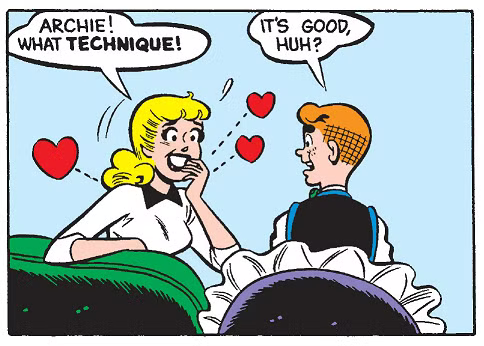

# Bevy Archie - Rust / Bevy Controller Support Module

[](https://opensource.org/licenses/MIT)
[](https://opensource.org/licenses/Apache-2.0)
[](https://www.rust-lang.org)
[](https://bevyengine.org)
[](target/coverage/tarpaulin-report.html)
[](https://bevy.org/learn/quick-start/plugin-development/#main-branch-tracking)
[](https://crates.io/crates/bevy_archie)
[](https://docs.rs/bevy_archie)



> **Note:** This branch (`main`) targets **Bevy 0.18**. Bevy 0.17 support is deprecated in 30 days (target date: **2026-05-18**). If you still need Bevy 0.17 during the maintenance window, use [`bevy-0.17`](https://github.com/greysquirr3l/bevy-archie/tree/bevy-0.17).

A comprehensive game controller support module for the Bevy engine, inspired by the RenPy Controller GUI project.

## Controller Support Matrix

| Controller           | Gyroscope | Touchpad | Adaptive Triggers | Rumble | Layout      |
|----------------------|:---------:|:--------:|:-----------------:|:------:|-------------|
| Xbox 360             | 🔴        | 🔴       | 🔴                | ✅     | Xbox        |
| Xbox One             | 🔴        | 🔴       | 🔴                | ✅     | Xbox        |
| Xbox Series X\|S     | 🔴        | 🔴       | 🔴                | ✅     | Xbox        |
| PlayStation 3        | ✅        | 🔴       | 🔴                | ✅     | PlayStation |
| PlayStation 4        | ✅        | ✅       | 🔴                | ✅     | PlayStation |
| PlayStation 5        | ✅        | ✅       | ✅                | ✅     | PlayStation |
| Switch Pro           | ✅        | 🔴       | 🔴                | ✅     | Nintendo    |
| Switch 2 Pro         | ✅        | 🔴       | 🔴                | ✅     | Nintendo    |
| Switch Joy-Con       | ✅        | 🔴       | 🔴                | ✅     | Nintendo    |
| Steam Controller     | ✅        | ✅       | 🔴                | ✅     | Xbox        |
| Stadia               | ✅        | 🔴       | 🔴                | ✅     | Xbox        |
| Amazon Luna          | 🔴        | 🔴       | 🔴                | ✅     | Xbox        |
| 8BitDo M30           | 🔴        | 🔴       | 🔴                | ✅     | Sega        |
| 8BitDo SN30 Pro      | 🔴        | 🔴       | 🔴                | ✅     | Nintendo    |
| HORI Fighting Cmd    | 🔴        | 🔴       | 🔴                | ✅     | PlayStation |
| Generic              | 🔶        | 🔶       | 🔴                | ✅     | Xbox        |

> **Legend**: ✅ Supported | 🔴 Hardware limitation | 🔶 Unknown (varies by device)
>
> **Note**: Gyroscope, touchpad, and adaptive triggers require platform-specific implementations. See [Advanced Features Guide](docs/ADVANCED_FEATURES.md) for details.

## Version Compatibility

| bevy | bevy_archie                                                                       |
|------|-----------------------------------------------------------------------------------|
| 0.18 | 0.2.x (`main`)                                                                    |
| 0.17 | [0.1.x (`bevy-0.17`)](https://github.com/greysquirr3l/bevy-archie/tree/bevy-0.17) |

> Bevy 0.17 support is deprecated and scheduled for end of support on **2026-05-18**.

## Features

### Core Input System

- **Input Device Detection**: Automatically detect and switch between mouse, keyboard, and gamepad input
- **Input Action Mapping**: Abstract input actions with customizable bindings for gamepad, keyboard, and mouse
- **Action State Tracking**: Query pressed, just_pressed, just_released states and analog values for any action
- **Per-Stick Settings**: Independent sensitivity and inversion for left/right analog sticks
- **Deadzone Configuration**: Configurable stick deadzones with per-stick customization

### Controller Support

- **Controller Icon System**: Asset-agnostic icon mapping system that adapts to controller type (Xbox, PlayStation, Nintendo, Steam, Stadia, Generic). Bring your own icon assets or use any compatible pack.
- **Controller Profiles**: Automatic detection and profile loading based on vendor/product IDs
- **Multi-controller Support**: Handle multiple connected controllers with player assignment
- **Controller Layout Detection**: Auto-detect and adapt UI to controller type

### Advanced Input Features

- **Actionlike Trait**: Define custom action enums with the `Actionlike` trait for type-safe input handling
- **Haptic Feedback**: Rumble and vibration patterns (Constant, Pulse, Explosion, DamageTap, HeavyImpact, Engine, Heartbeat) - fully implemented
- **Input Buffering**: Record and analyze input sequences for fighting game-style combo detection
- **Action Modifiers**: Detect Tap, Hold, DoubleTap, LongPress, and Released events on actions
- **Button Chords**: Detect simultaneous button combinations with configurable clash resolution
- **Virtual Input Composites**: Combine buttons into virtual axes (`VirtualAxis`, `VirtualDPad`, `VirtualDPad3D`)
- **Conditional Bindings**: Context-aware actions that activate based on game state or custom conditions
- **Input State Machine**: Define state machines driven by input actions with automatic transitions
- **Gyroscope Support**: Motion controls for PS4/PS5/Switch/Stadia/Steam controllers - complete gesture detection and data structures, needs hardware driver integration (HID/SDL2). See [ps5_dualsense_motion.rs](examples/ps5_dualsense_motion.rs) and [switch_pro_gyro.rs](examples/switch_pro_gyro.rs)
- **Touchpad Support**: PS4/PS5/Steam touchpad input with multi-touch and gesture detection (swipe, pinch, tap) - complete gesture detection and data structures, needs hardware driver integration (HID/SDL2). See [ps5_dualsense_motion.rs](examples/ps5_dualsense_motion.rs) and [steam_touchpad.rs](examples/steam_touchpad.rs)

### Multiplayer

- **Player Assignment**: Automatic or manual controller-to-player assignment (up to 4 players)
- **Controller Ownership**: Track which player owns which controller
- **Hot-swapping**: Handle controller disconnection and reassignment

### UI & Configuration

- **Controller Remapping**: Allow players to remap controller buttons at runtime
- **Virtual Keyboard**: On-screen keyboard for controller-friendly text input
- **Virtual Cursor**: Gamepad-controlled cursor for mouse-based UI navigation
- **Configuration Persistence**: Save and load controller settings to/from JSON files

### Developer Tools

- **Input Debugging**: Visualize input states, history, and analog values
- **Input Recording**: Record input sequences for testing and replay
- **Input Playback**: Play back recorded inputs for automated testing
- **Input Mocking**: `MockInput` and `MockInputPlugin` for unit testing input-dependent systems
- **Build Helpers**: Generate icon manifests and organize controller assets at build time

### Mobile & Touch

- **Touch Joystick**: Virtual on-screen joysticks for mobile platforms with fixed or floating modes

### Networking

- **Input Synchronization**: `ActionDiff` and `ActionDiffBuffer` for efficient network input sync with rollback support

## Supported Controllers

- **Xbox** - Xbox 360, Xbox One, Xbox Series X|S controllers
- **PlayStation** - PS3, PS4, PS5 (DualShock 3, DualShock 4, and DualSense)
- **Nintendo** - Switch Pro Controller, Switch 2 Pro, Joy-Cons
- **Steam** - Steam Controller, Steam Deck
- **Stadia** - Google Stadia Controller (Bluetooth mode)
- **Amazon Luna** - Amazon Luna Controller (Xbox-style layout)
- **8BitDo** - M30 (Sega-style), SN30 Pro (Nintendo-style)
- **HORI** - Fighting Commander, HORIPAD series
- **Generic** - Any other standard gamepad

**Note**: Stadia controllers must be switched to Bluetooth mode (a permanent one-time operation that was available until Dec 31, 2025). In Bluetooth mode, they function as standard Xbox-style gamepads.

## Installation

Add to your `Cargo.toml`:

```toml
[dependencies]
bevy_archie = { path = "path/to/bevy-archie" }
# Or with specific features:
bevy_archie = { path = "path/to/bevy-archie", features = ["full"] }
```

### Library Size

| Configuration    | Pre-link (.rlib) | Final Binary Impact |
| ---------------- | ---------------- | ------------------- |
| Default features | ~8.7 MB          | ~200-400 KB         |
| All features     | ~9.7 MB          | ~300-500 KB         |

The `.rlib` size includes Rust metadata and monomorphization templates. After LTO and dead code elimination, bevy_archie adds roughly **0.5-1%** overhead on top of a typical Bevy application (~50-80 MB).

## Quick Start

```rust
use bevy::prelude::*;
use bevy_archie::prelude::*;

fn main() {
    App::new()
        .add_plugins(DefaultPlugins)
        .add_plugins(ControllerPlugin::default())
        .add_systems(Startup, setup)
        .add_systems(Update, handle_input)
        .run();
}

fn setup(mut commands: Commands) {
    commands.spawn(Camera2d);
}

fn handle_input(
    input_state: Res<InputDeviceState>,
    actions: Res<ActionState>,
) {
    // Check which input device is active
    match input_state.active_device {
        InputDevice::Mouse => { /* Mouse logic */ }
        InputDevice::Keyboard => { /* Keyboard logic */ }
        InputDevice::Gamepad(_) => { /* Controller logic */ }
    }

    // Check action states
    if actions.just_pressed(GameAction::Confirm) {
        println!("Confirm pressed!");
    }
}
```

## Action System

Define your game actions and bind them to controller buttons:

```rust
use bevy_archie::prelude::*;

// Actions are predefined, but you can extend with custom actions
fn setup_actions(mut action_map: ResMut<ActionMap>) {
    // Rebind an action
    action_map.bind(GameAction::Confirm, GamepadButtonType::South);
    action_map.bind(GameAction::Cancel, GamepadButtonType::East);
    
    // Add keyboard bindings
    action_map.bind_key(GameAction::Confirm, KeyCode::Enter);
    action_map.bind_key(GameAction::Cancel, KeyCode::Escape);
}
```

## Controller Icons

**Note**: bevy-archie is asset-agnostic. You must provide your own icon assets or use a compatible icon pack like:

- [Mr. Breakfast's Free Prompts](https://mrbreakfastsdelight.itch.io/mr-breakfasts-free-prompts) (400+ icons, Xbox/PS/Switch/Steam Deck)
- [Kenney Input Prompts](https://kenney.nl/assets/input-prompts)
- Custom artwork

The icon system provides platform-aware filename generation and asset loading infrastructure. Point it to your icon directory:

```rust
fn setup_icons(mut commands: Commands) {
    commands.insert_resource(
        ControllerIconAssets::new("assets/icons")  // Your icon directory
    );
}
```

Display controller-appropriate button icons in your UI:

```rust
fn spawn_button_prompt(
    mut commands: Commands,
    icon_assets: Res<ControllerIconAssets>,
    input_state: Res<InputDeviceState>,
) {
    let icon = icon_assets.get_icon(
        GamepadButtonType::South,
        input_state.controller_layout,
    );
    
    commands.spawn(ImageNode {
        image: icon,
        ..default()
    });
}
```

### Icon Naming Conventions

The system expects icons named according to platform conventions:

- **Xbox**: `xbox_a.png`, `xbox_b.png`, `xbox_lb.png`, `xbox_lt.png`
- **PlayStation**: `ps_cross.png`, `ps_circle.png`, `ps_l1.png`, `ps_l2.png`
- **Nintendo**: `switch_b.png`, `switch_a.png`, `switch_l.png`, `switch_zl.png`
- **Generic**: `left_stick.png`, `right_stick.png`, `dpad.png`

Icon sizes are supported via suffixes: `xbox_a_small.png` (32x32), `xbox_a.png` (48x48), `xbox_a_large.png` (64x64).

If your icon pack uses different naming, create a thin wrapper or use symbolic links to match the expected names.

## Remapping

Enable controller remapping in your settings menu:

```rust
fn spawn_remap_ui(mut commands: Commands) {
    commands.spawn((
        RemapButton {
            action: GameAction::Confirm,
        },
        // ... UI components
    ));
}
```

## Configuration

```rust
use bevy_archie::prelude::*;

fn configure_controller(mut config: ResMut<ControllerConfig>) {
    // Stick deadzone (0.0 - 1.0)
    config.deadzone = 0.15;
    
    // Per-stick sensitivity multipliers
    config.left_stick_sensitivity = 1.0;
    config.right_stick_sensitivity = 1.5; // Faster cursor movement
    
    // Per-stick X-axis inversion
    config.invert_left_x = false;
    config.invert_right_x = true; // Inverted camera controls
    
    // Auto-detect controller layout
    config.auto_detect_layout = true;
    
    // Force a specific layout
    config.force_layout = Some(ControllerLayout::PlayStation);
}
```

## Virtual Cursor

Enable gamepad-controlled cursor for mouse-based UI:

```rust
use bevy::prelude::*;
use bevy_archie::prelude::*;

fn setup(mut commands: Commands, asset_server: Res<AssetServer>) {
    // Spawn virtual cursor (automatically shown when gamepad active)
    bevy_archie::virtual_cursor::spawn_virtual_cursor(
        &mut commands,
        &asset_server,
        None, // Uses default cursor.png
    );
}

fn handle_clicks(mut click_events: EventReader<VirtualCursorClick>) {
    for event in click_events.read() {
        println!("Cursor clicked at: {:?}", event.position);
    }
}
```

## Configuration Persistence

Save and load controller settings:

```rust
use bevy_archie::prelude::*;

// Load config on startup
fn load_config(mut config: ResMut<ControllerConfig>) {
    *config = ControllerConfig::load_or_default().unwrap();
}

// Save config
fn save_config(config: Res<ControllerConfig>) {
    config.save_default().unwrap();
}

// Custom path
fn save_to_custom_path(config: Res<ControllerConfig>) {
    config.save_to_file("my_config.json").unwrap();
}
```

Config files are saved to platform-specific directories:

- **Linux**: `~/.config/bevy_archie/controller.json`
- **macOS**: `~/Library/Application Support/bevy_archie/controller.json`
- **Windows**: `%APPDATA%\bevy_archie\controller.json`

## Examples

Bevy-archie includes several examples to help you get started:

### Basic Examples

- **[basic_input.rs](examples/basic_input.rs)**: Simple input handling
- **[controller_icons.rs](examples/controller_icons.rs)**: Display controller-specific icons
- **[remapping.rs](examples/remapping.rs)**: Runtime button remapping
- **[virtual_cursor.rs](examples/virtual_cursor.rs)**: Gamepad-controlled cursor
- **[config_persistence.rs](examples/config_persistence.rs)**: Save/load settings

### Advanced Hardware Integration

These examples show how to integrate real hardware for gyro and touchpad:

- **[ps5_dualsense_motion.rs](examples/ps5_dualsense_motion.rs)**: DualSense gyro + touchpad via hidapi
  - Complete HID report parsing reference
  - Both USB and Bluetooth modes
  - Calibration and data injection patterns
  
- **[switch_pro_gyro.rs](examples/switch_pro_gyro.rs)**: Switch Pro Controller gyro via SDL2
  - Cross-platform gyro support
  - Alternative: Direct HID approach
  
- **[steam_touchpad.rs](examples/steam_touchpad.rs)**: Steam Deck/Steam Controller touchpad
  - Steam Input API integration (recommended)
  - Alternative: Direct HID for advanced users

Run examples with:

```bash
cargo run --example basic_input
cargo run --example ps5_dualsense_motion --features motion-backends
```

## Supported Controller Layouts

- **Xbox**: Xbox 360, Xbox One, Xbox Series controllers
- **PlayStation**: DualShock 3/4, DualSense
- **Nintendo**: Joy-Con, Pro Controller, GameCube
- **Steam**: Steam Controller, Steam Deck
- **Stadia**: Google Stadia Controller (Bluetooth mode)
- **Amazon Luna**: Amazon Luna Controller (Xbox-style layout)
- **Generic**: Fallback for unrecognized controllers

## Documentation Map

For a faster overview, this README stays focused on setup and common workflows.
Deep dives are split into dedicated docs:

- [Advanced Features Guide](docs/ADVANCED_FEATURES.md)
- [API Reference Guide](docs/API_REFERENCE.md)
- [Hardware Integration Guide](docs/HARDWARE_INTEGRATION_GUIDE.md)
- [Test Coverage Guide](docs/TEST_COVERAGE.md)

## Testing

Quick commands:

```bash
cargo test --lib
cargo test
cargo test --all-features
```

For detailed coverage setup and reports, see [Test Coverage Guide](docs/TEST_COVERAGE.md).

## Credits

Inspired by the [RenPy Controller GUI](https://feniksdev.com) by Feniks.

## License

Licensed under either of:

- Apache License, Version 2.0 ([LICENSE-APACHE](LICENSE-APACHE))
- MIT license ([LICENSE-MIT](LICENSE-MIT))

at your option.
